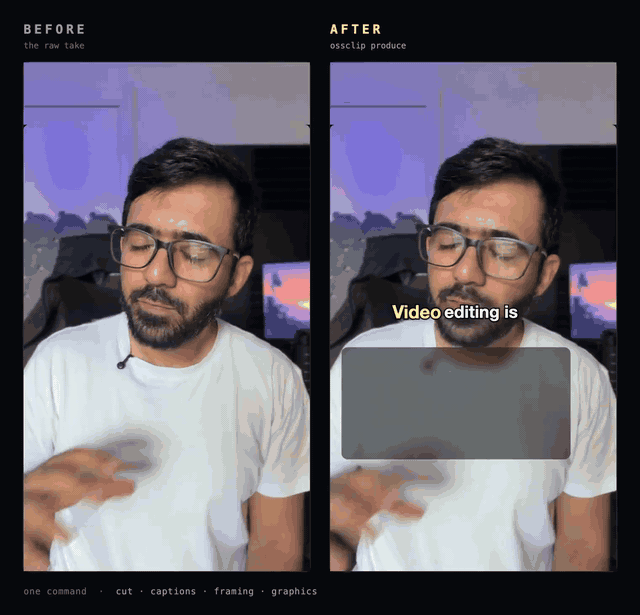
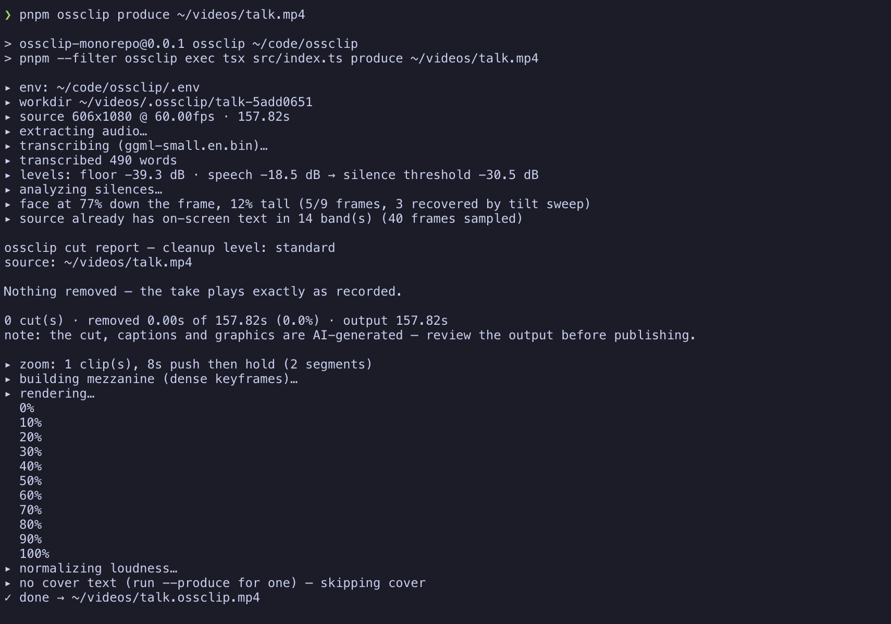
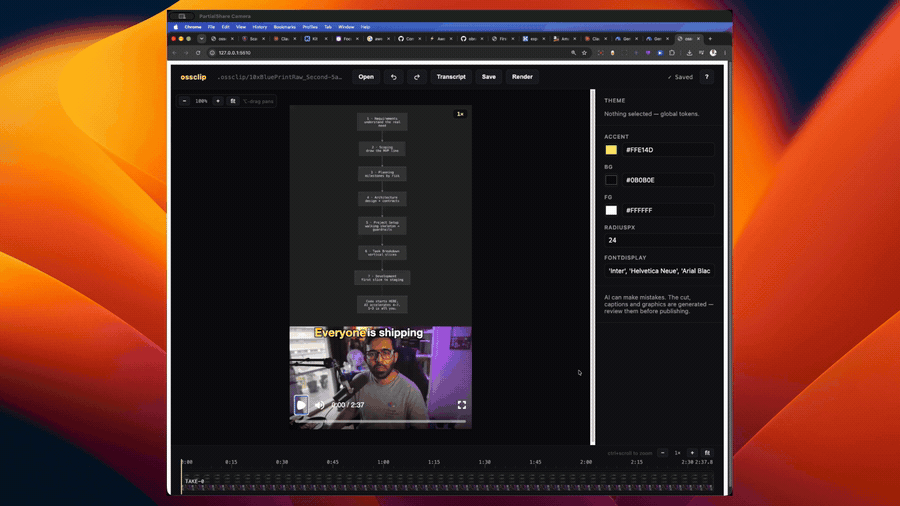

# ossclip

[](https://github.com/AhsanAyaz/ossclip/actions/workflows/ci.yml)
[](https://www.npmjs.com/package/ossclip)
[](https://ahsanayaz.github.io/ossclip/)



<p align="center"><em>Left: the raw take. Right: what <code>ossclip produce</code> returns — cuts, word-timed captions, face-aware framing and code-rendered graphics.</em></p>

**A local-first CLI that turns a talking-head take into a finished short.** It cuts silence and filler words, writes word-timed kinetic captions, frames on the measured face, and has an LLM plan **code-rendered on-screen graphics** — title cards, stat cards, diagrams, terminal and chat mockups — from what was actually said. Transcription is local (whisper.cpp), rendering is local (Remotion); the only network calls are the LLM planning ones, on your own key or your existing Claude Code subscription. Vertical 9:16 by default, landscape 16:9 with `--aspect`.

The graphics layer is the part comparable tools don't have: nine Zod-typed scene components ([`packages/core/src/scene-registry.ts`](./packages/core/src/scene-registry.ts)) each carry a `whenToUse` contract the LLM producer plans against, every planned scene validates against its schema before it renders, and a fit contract keeps every component inside the platform-safe area on real copy. Open-source alternatives stop at find → crop → caption; commercial tools gate the graphics layer behind paid tiers.

**Scope, honestly:** ossclip is at its best **polishing a take you have already cut down** — every finding in this repo came from real 30–70 s takes. For long-form input, `--clip <seconds>` selects the **single strongest window** (chosen by the producer in the same editorial call that plans the graphics, snapped to sentence boundaries) and produces only that; it is the newest part of the pipeline and has had the least real-footage mileage. It extracts one clip, not N — multi-clip is not built. Without `--clip`, feed it 20 minutes and you get a polished 20 minutes.

> **Status: working end to end, pre-1.0.** Cut, captions, zoom, scene graphics, the LLM producer, cover images and a direct-manipulation editor are all built and exercised on real footage. Interfaces still move between rounds. See [`docs/PHASE1-FINDINGS.md`](./docs/PHASE1-FINDINGS.md) for the running defect log — every fix in this repo traces to a numbered finding from a real render.

**Docs:** a single-page reference — install, concepts, keybinds, flags — is live at **[ahsanayaz.github.io/ossclip](https://ahsanayaz.github.io/ossclip/)** (source: [`docs/site/index.html`](./docs/site/index.html), self-contained).

## Install

Two commands, on macOS, Linux, or Windows (plain PowerShell — no WSL, no admin rights):

```sh
npm install -g ossclip
ossclip setup
```

`ossclip setup` provisions everything ossclip runs on, into one folder (`~/.ossclip`): a static [ffmpeg](https://ffmpeg.org) build, a prebuilt [whisper.cpp](https://github.com/ggml-org/whisper.cpp) `whisper-cli` (on macOS both come via Homebrew), and the transcription model — `small.en`, ~466 MB, the biggest piece of a ~600 MB total. It shows the plan with sizes and asks before downloading, resumes interrupted downloads, verifies checksums, and **skips anything you already have** — an ffmpeg already on your PATH stays yours. It records absolute paths in `~/.ossclip/config.json`, so nothing edits your PATH. Uninstalling is `npm rm -g ossclip` plus deleting `~/.ossclip`.

Setup also offers to save an LLM key for `--produce` (the graphics planner): a logged-in [Claude Code](https://claude.com/claude-code) is detected automatically, or paste an `ANTHROPIC_API_KEY` or `GEMINI_API_KEY`. Skip it freely — cut + captions run fully local without one.

If anything looks wrong later, one command diagnoses it: `ossclip doctor` prints a line per prerequisite and the exact fix.

> **Never used a terminal?** That's fine. Install Node ≥ 22 from [nodejs.org](https://nodejs.org) (a normal click-through installer), open a terminal (macOS: press ⌘-space, type *terminal*; Windows: open the Start menu, type *PowerShell*), paste the two lines above, press Enter, and answer the questions. Expect the downloads to take a few minutes.

Licence note, since setup downloads binaries: the static ffmpeg builds it fetches ([BtbN](https://github.com/BtbN/FFmpeg-Builds)) are GPL, downloaded onto your machine at your request — nothing GPL ships inside the MIT npm package.

### Manual install (if you'd rather own the toolchain)

```sh
brew install ffmpeg whisper-cpp        # macOS; Linux/Windows: ffmpeg from your package manager,
                                       # whisper-cli from https://github.com/ggml-org/whisper.cpp/releases

mkdir -p ~/.ossclip/models
curl -L -o ~/.ossclip/models/ggml-small.en.bin \
  https://huggingface.co/ggerganov/whisper.cpp/resolve/main/ggml-small.en.bin
```

`ossclip doctor` checks all of it — Node ≥ 22, `ffmpeg`/`ffprobe`, `whisper-cli`, the model, an LLM provider — and prints the per-platform command for anything missing. Binaries can live anywhere: point `OSSCLIP_FFMPEG` / `OSSCLIP_WHISPER` (or `config.json`) at them. Setup and manual install compose — setup only ever fills the gaps doctor would flag.

`small.en` is the default model. A mistranscribed word ends up in your captions *and* on a graphic, so accuracy matters more here than speed — which is also why `--produce` runs a repair pass over the transcript before anything is drawn. Compare models on your own footage with `--whisper-model base.en|small.en|medium.en` (~142 MB / ~466 MB / ~1.5 GB; `ossclip setup --model <name>` downloads any of them).

## Quick start

```sh
# The whole thing: cut + captions + LLM-planned graphics + cover
ossclip produce input.mp4 --produce -o out.mp4

# Just the cut and captions — no LLM, no network
ossclip produce input.mp4 -o out.mp4

# See what would be cut and why, without rendering
ossclip produce input.mp4 --no-render

# Long-form in, one short out: the strongest ~60s window, chosen by the producer
ossclip produce podcast.mp4 --produce --clip 60 -o clip.mp4
```



<p align="center"><em>One <code>ossclip produce</code> run, end to end — every stage says what it did and why, and the cut report is written beside the video.</em></p>

Every run writes a **work directory** next to the input (`<input dir>/.ossclip/<name>-<hash>/`, the hash taken from the source's *content* — so the same footage reuses its cache, `--workdir` starts a separate project, and deleting the directory forces a clean run) holding the transcript, the analysis, `production.json`, `render-props.json`, `report.txt`, `usage.json`, and the cached LLM plan. It is a cache: delete it to force a clean run, keep it and re-runs are near-instant.

### Not sure what to run?

```sh
ossclip
```

Opens a menu — produce a video, open the editor on something you already
produced, set up your install, or check what's missing. Every choice prints
the equivalent command before it runs, so the menu is also how you learn the
flags.

`ossclip produce` with no file name does the same thing for just the produce
options. And `ossclip edit` with no path opens a picker over your recent
runs — you never have to know that produce writes into
`<your video's folder>/.ossclip/<name>/`.

## Editing what it produced



```sh
ossclip edit "<work directory>"     # opens http://127.0.0.1:5174
ossclip edit                        # bare: pick from recent projects, or browse
```

- **Click** an element to select it, **drag** to move, **double-click** to retype.
- **Timeline**: click a scene to select and seek to that point, press-and-drag to scrub, drag a block body to move it in time, drag its edges to retime it.
- **SPACE** toggles playback, **⌘Z** / **⌘⇧Z** undo and redo (also in the top bar), **⌘S** saves. Press **?** for the full keybinds reference.
- **Open** in the top bar switches projects in place — recent produce runs plus a folder browser, no server restart.

Edits land in `<workdir>/overrides.json` — a file the producer never writes. Re-running `produce` re-plans the video and **keeps your edits**.

## The commands

| command | what it does |
| --- | --- |
| `produce <input>` | the full pipeline: transcribe → analyze → cut → captions → scenes → render (+ cover) |
| `edit [workdir]` | direct-manipulation editor; bare `edit` opens a project picker |
| `setup` | install ffmpeg, whisper.cpp and the model into `~/.ossclip` — the one-command onboarding (`--model <name>`, `--skip-llm`, `--force`, `--yes`) |
| `doctor` | check every prerequisite and print the exact fix for anything missing |
| `transcribe <input>` | stops after the transcript and cut report — no render |
| `studio <render-props.json>` | opens Remotion Studio on a produced composition, for visual debugging |

### `produce` flags worth knowing

| flag | |
| --- | --- |
| `--produce` | run the LLM producer brain (title cards, stat cards, diagrams, cover text). Without it you get cut + captions only |
| `--clip <seconds>` | produce only the strongest ~N-second window of a long take, sentence-snapped (requires `--produce`; a source already at or under the target is produced whole). The report says what was chosen and why |
| `--intent "<text>"` | what the video should be — steers the producer's editorial choices |
| `--speaker "<who>"` | who is on camera, e.g. `"Ahsan, host of Code with Ahsan"`. Helps the repair pass recognise a mangled name and stops grounding flagging it |
| `--cleanup <level>` | `exact` \| `light` \| `standard` \| `aggressive`. How hard to cut silence and fillers |
| `--aspect <ratio>` | `9:16` (default) or `16:9` — landscape export with landscape-native layouts |
| `--source-fit <mode>` | `cover` crops to fill; `contain` shows the whole frame inset — the landscape-source escape hatch |
| `--llm <provider>` | `claude` \| `claude-cli` \| `gemini` \| `mock` |
| `--llm-model <id>` / `--llm-fast-model <id>` | override the editorial / mechanical model. `--llm-fast-model same` disables tiering |
| `--no-repair` | skip the ASR mishearing repair; captions then show the raw transcription |
| `--whisper-model <name>` | transcription model for this run |
| `--scenes <path>` | hand-authored scenes JSON — no LLM in the loop |
| `--force-component <id>` | debug: render every graphic with one component (e.g. `FlowDiagram`) to exercise it on real copy |
| `--source-is-edited` | the source is already an edited reel with burned-in text — keep ossclip's graphics off it (also what enables the source-text scan) |
| `--blooper-marker <word>` | say the word on camera and the flubbed take is cut, back to the start of the sentence it spoiled. Off unless given |
| `--no-cover` / `--cover <path>` | skip, or redirect, the cover image written beside the video |
| `--no-render` | stop after writing the props |
| `--workdir <dir>` | where the cache lives |

### Which model runs

Without `--llm`, ossclip picks in this order: **`GEMINI_API_KEY` → `ANTHROPIC_API_KEY` → the Claude Code CLI**. The CLI path uses your logged-in Pro/Max subscription, so it costs plan usage rather than API credits — the console tells you which path it took.

Calls are **tiered**: the beat sheet (the editorial judgement the video rests on) goes to the main model; mechanical calls (transcript repair aside, which is also editorial) go to a smaller sibling. Override with `--llm-fast-model`.

### What each run costs

```
▸ llm: 3 calls · 130,749 in / 8,321 out tokens · ~$0.72 of API-rate work, covered by the subscription · 92s
```

A per-call breakdown lands in `report.txt`, the raw records in `usage.json`. Two rules the output holds to: token counts a provider actually reports are exact and anything derived from text length is marked `(est)`; a model with no known price is reported with its tokens and **no cost guess**. On the subscription path the figure is what the same tokens would cost at API rates — nothing is charged, but you can still see how much work a run was.

Prices are a built-in per-family assumption. Override for your account in `~/.ossclip/config.json`:

```json
{ "pricing": { "claude-opus-5": { "inputPerMTok": 5, "outputPerMTok": 25 } } }
```

## Configuration

`~/.ossclip/config.json` — all optional:

```json
{
  "model": "small.en",
  "speaker": "Ahsan, host of the Code with Ahsan channel",
  "fastModel": "claude-haiku-4-5-20251001",
  "ffmpegPath": "ffmpeg",
  "whisperPath": "whisper-cli",
  "modelDir": "~/.ossclip/models",
  "browserExecutable": "/path/to/chrome"
}
```

Provider keys are read from the environment, and ossclip loads `.env` files before it picks a provider — first hit wins per key, and a real environment variable always beats a file:

```
$OSSCLIP_ENV_FILE   →   .env, walking up from the cwd   →   ~/.ossclip/.env
```

```sh
# .env  (gitignored)
GEMINI_API_KEY=…
```

Env vars override the file: `OSSCLIP_FFMPEG`, `OSSCLIP_FFPROBE`, `OSSCLIP_WHISPER`, `OSSCLIP_MODEL_DIR`, `OSSCLIP_MODEL`, `OSSCLIP_FAST_MODEL`, `OSSCLIP_SPEAKER`, `OSSCLIP_BROWSER`.

## What it does to your footage

- **Cuts** dead air and filler words, with every cut justified in `report.txt`.
- **Repairs** ASR mishearings before anything is drawn, so a graphic and the caption under it can never spell the same word two different ways. Strictly near-homophones only — it will refuse a rewrite and say so.
- **Frames** on the measured face rather than a constant, including sources that are letterboxed or that change framing mid-take (those get normalized to one field of view before anything else runs).
- **Plans** scenes from the transcript, then checks its own choices: a layout that would crop the speaker's head is rewritten, and copy that isn't grounded in what was actually said is flagged.
- **Captions** every word, routed around any text already burned into the source.
- **Covers** — writes `<out>.cover.jpg` sized for the platform the aspect targets.

> AI can make mistakes. The cut, the captions and every graphic are generated — review the output (the editor and `report.txt` exist for exactly that) before publishing.

## Working from a clone (contributors)

```sh
pnpm install
pnpm build             # builds the editor page; needed once before `ossclip edit`
pnpm ossclip produce input.mp4 --produce -o out.mp4

pnpm test              # vitest
pnpm typecheck
node scripts/make-fixture.mjs    # regenerates the deterministic test fixtures
```

## Repo layout

```
packages/core      framework-free pipeline: schema, ingest, transcribe, analyze, cutlist,
                   timemap, captions, framing/normalization, the LLM producer
packages/scenes    React components shared by preview & render (EdlVideo, CaptionTrack, SceneLayer)
packages/renderer  Remotion composition + programmatic render entry
apps/cli           the ossclip CLI (published to npm as `ossclip`)
apps/editor        direct-manipulation editing page over a produced workdir (`ossclip edit`)
```

## Licensing

ossclip's own code is **MIT** — see [LICENSE](./LICENSE).

Rendering uses [Remotion](https://www.remotion.dev/), which is **source-available under its own two-tier licence**, not MIT: free for individuals, non-profits, and for-profit companies up to the size stated in its terms; for-profit companies above that threshold need a paid [Remotion Company Licence](https://www.remotion.dev/license). If you use ossclip inside a company, check [Remotion's LICENSE](https://github.com/remotion-dev/remotion/blob/main/LICENSE.md) — its terms, not this README, are authoritative.
